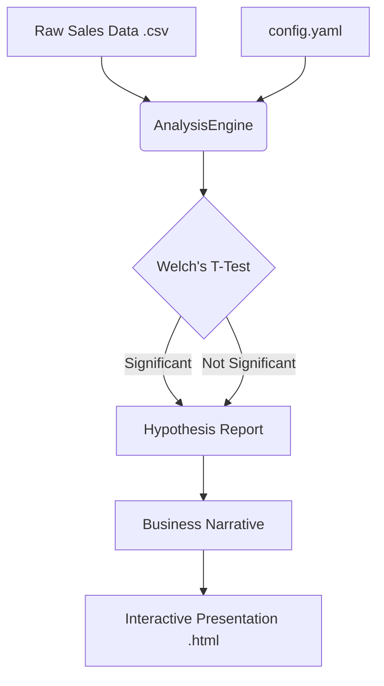

# System Architecture - ApexPlanet Task 4

This document provides a high-level overview of the architecture and data flow for the ApexPlanet Task 4 Data Analytics project.

## Workflow Overview

The system is designed to transform raw transaction data into validated business insights and executive-ready presentations.

## Components

### 1. Data Layer
-   **Source**: `sales_data.csv` containing transaction ID, customer age, and purchase amount.
-   **Configuration**: `config.yaml` defines the data path and the age ranges for comparison groups.

### 2. Analysis Engine (`statistical_test.py`)
-   **Purpose**: Orchestrates the statistical validation.
-   **Methodology**: Uses Welch's T-Test to compare means across independent groups without assuming equal variance.
-   **Verification**: Comprehensive unit test suite (`test_statistical_test.py`) ensures logic reliability.

### 3. Reporting & Visualization Layer
-   **narrative**: `data_story.md` provides the tactical bridge between data and strategy.
-   **Visual**: `final_presentation.html` uses Chart.js for interactive stakeholder communication.

## Quality Assurance
-   **CI/CD**: GitHub Actions runs on every push to ensure code quality via `flake8` and `pytest`.
-   **Documentation**: Standardized documentation following professional repository structures.
